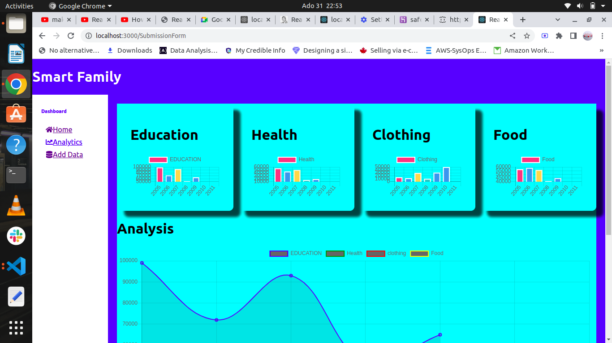

# Smart Family App
####  The Smart Family App is a powerful tool that allows members in a family to gain insights into their finance. The application converts the families expenditure into useful charts and splits the expenditure into four broad categories; Education, Health, Clothing and Food.,31/07/2022.

#### By **Gitau Elvis Munene**
## Description
With this app, members of a family especially parents are able to understand their finances in more detail. Besides, the application allows them to add data that they might use to make predictions. Altogether, the application enables people to make informed financial decisions.

# Public API link
https://safe-journey-19911.herokuapp.com/data
## Setup/Installation Requirements
* Visual Studio
* Installation of dependancies.
* Server.
## Known Bugs
Not fully deployed yet.
## Technologies Used
*HTML
*CSS
*React.
## Support and contact details
Email: elvisgitau10@gmail.com
slack: Gitau Elvis

### License
 **MIT License Copyright (c) 2022 Elvis Munene*
